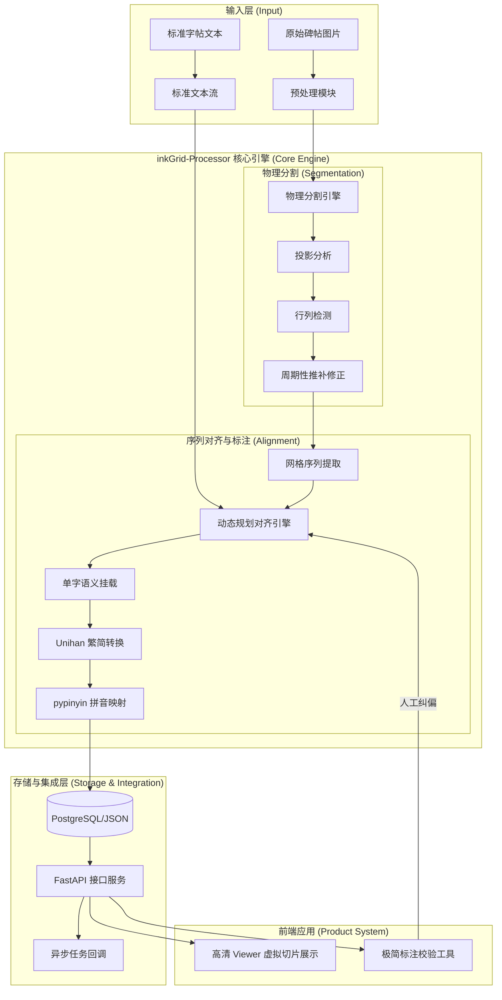

# inkGrid 碑帖数字化核心技术方案 (V2.0 务实集成版)

## 0. 系统架构图

## 1. 方案目标
构建一个高效、专业级的自动化流水线，将中国书法碑帖图片切分为独立单字，并自动关联文本、拼音及语义信息。该方案作为“墨阵 (InkGrid)”系统的核心生产引擎，旨在支撑千万级书法字形的数字化积累。

## 2. 技术路线：基于先验文本的序列对齐 (Sequence Alignment)

### 2.1 物理切分 (Segmentation) - AI 主导
- **算法核心**：利用 OpenCV 的自适应投影分析。
- **周期性推补**：针对碑帖残损导致的检测断裂，利用计算出的“行高/列宽”中位数步长，自动补全虚拟网格。
- **多维度支持**：优先适配篆、隶、楷等规整碑帖。

### 2.2 自动标注 (Auto-Labeling) - 序列映射
- **对齐逻辑**：已知碑帖全文，按传统书法“从右至左、从上至下”的逻辑，将物理网格序列与字符文本序列进行动态规划对齐。
- **语义增强**：自动挂载 `Unihan` 繁简转化数据及 `pypinyin` 拼音数据。

### 2.3 人机校验 (Human-in-the-loop) - 极简纠偏
- **UI 策略**：用户仅需处理“合文”或“多余空格”，通过点击即可触发整个序列的自动重排，无需手动标注每一个字。

## 3. 集成与产出方案 (Product Integration)

### 3.1 产出形态：inkGrid-Processor 微服务
- **技术栈**：Python 3.11 + FastAPI + Celery。
- **部署方式**：Docker 容器化，支持在 Kubernetes 环境下水平扩展。
- **集成方式**：通过 RESTful API 提供服务，支持异步回调机制，适应墨阵主系统的任务调度。

### 3.2 大规模批量处理 (Massive Processing)
- **生产流水线**：支持指定 S3 桶或本地目录进行扫描。
- **幂等性保障**：记录处理指纹，防止重复处理，支持断点续传。

### 3.3 数据契约 (JSON Data Schema)
输出统一的 `CharacterMetadata` 格式，包含：
- `tablet_id`: 碑帖唯一标识
- `characters`: 列表，每个元素包含：
    - `char`: 对应文字
    - `bbox`: `[x, y, w, h]` 坐标
    - `pinyin`: 拼音
    - `confidence`: 置信度评分

## 4. 落地步骤
1. **Step 1 (Core)**: 编写 `detect_grid.py` 核心算法，验证 `yishan.jpg` 和 `caoquanbei` 样本。
2. **Step 2 (Service)**: 封装 FastAPI 接口，实现初步的异步处理流程。
3. **Step 3 (Integration)**: 与墨阵前端 Viewer 对接，验证“逻辑坐标”加载“物理切片”的性能。